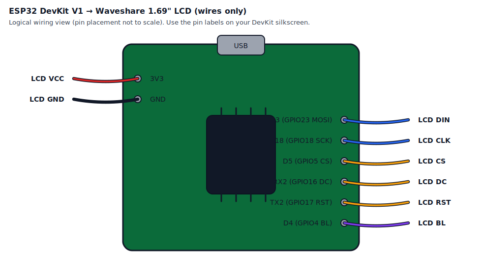
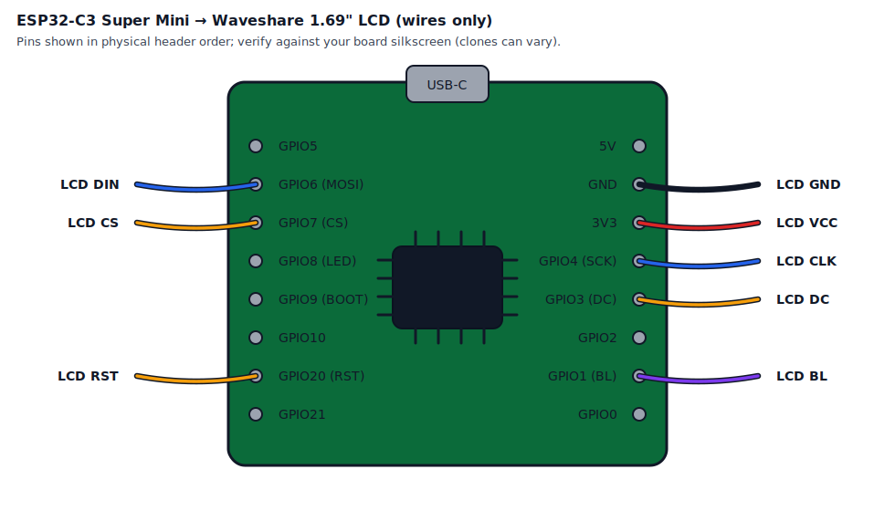

# ESP32 DevKit V1 + ESP32-C3 Super Mini to Waveshare 1.69" LCD Pinout Guide

## Overview

This document provides wiring guidance for connecting a Waveshare 1.69" LCD Module to:

- ESP32 DevKit V1 (classic ESP32)
- ESP32-C3 Super Mini

The LCD uses SPI communication and requires 8 connections total.

## LCD Module Specifications

- **Display**: 1.69 inch IPS LCD
- **Resolution**: 240×280 pixels
- **Controller**: ST7789V2
- **Interface**: 4-wire SPI
- **Operating Voltage**: 3.3V (compatible with ESP32)
- **Connector**: GH1.25 8-pin

## Pin Mapping Table

### ESP32 DevKit V1 (classic ESP32)

| LCD Pin | Function | ESP32 GPIO | ESP32 Pin Label | Notes |
|---------|----------|------------|-----------------|-------|
| **VCC** | Power | 3.3V | 3V3 | Do NOT use 5V |
| **GND** | Ground | GND | GND | Common ground |
| **DIN** | SPI MOSI | GPIO 23 | D23 | Data In (VSPI MOSI) |
| **CLK** | SPI Clock | GPIO 18 | D18 | Clock (VSPI SCK) |
| **CS** | Chip Select | GPIO 5 | D5 | Slave select |
| **DC** | Data/Command | GPIO 16 | RX2 | Mode selection |
| **RST** | Reset | GPIO 17 | TX2 | Hardware reset |
| **BL** | Backlight | GPIO 4 | D4 | PWM for brightness control |

## Wiring Diagram

SVG diagram (recommended):



```
ESP32 DevKit V1                  1.69" LCD Module
┌───────────────┐               ┌──────────────┐
│               │               │              │
│   3V3 (3.3V)  ├──────────────►│ VCC          │
│   GND         ├──────────────►│ GND          │
│   D23 (GPIO23)├──────────────►│ DIN (MOSI)   │
│   D18 (GPIO18)├──────────────►│ CLK (SCK)    │
│   D5  (GPIO5) ├──────────────►│ CS           │
│   RX2 (GPIO16)├──────────────►│ DC           │
│   TX2 (GPIO17)├──────────────►│ RST          │
│   D4  (GPIO4) ├──────────────►│ BL           │
│               │               │              │
└───────────────┘               └──────────────┘
```

## ESP32-C3 Super Mini (ESP32-C3) Pinout Notes

The ESP32-C3 Super Mini has a different GPIO set than the classic ESP32, and its Arduino “default SPI pins” are different as well.

Reference pinout (verify against your board silkscreen; some clones vary):
- https://randomnerdtutorials.com/getting-started-esp32-c3-super-mini/

### ESP32-C3 strapping pins (avoid for LCD control)

Per the reference above, these are strapping-sensitive on many ESP32-C3 Super Mini boards:
- GPIO2
- GPIO8 (also onboard LED)
- GPIO9 (BOOT button)

Avoid using those for LCD `CS/DC/RST/BL` to reduce boot issues.

## Pin Mapping Table (ESP32-C3 Super Mini)

This is the recommended wiring for this project’s default ESP32-C3 overrides in [src/boards/esp32c3/board_overrides.h](../src/boards/esp32c3/board_overrides.h).

| LCD Pin | Function | ESP32-C3 GPIO / Pin | Notes |
|---------|----------|----------------------|-------|
| **VCC** | Power | 3V3 | Prefer 3.3V for logic-level safety |
| **GND** | Ground | GND | Common ground |
| **DIN** | SPI MOSI | GPIO6 | LCD data in |
| **CLK** | SPI Clock | GPIO4 | LCD clock |
| **CS** | Chip Select | GPIO7 | SPI SS |
| **DC** | Data/Command | GPIO3 | Control pin |
| **RST** | Reset | GPIO20 | Control pin |
| **BL** | Backlight | GPIO1 | PWM-capable |

## Physical Pin Header Layout (ESP32-C3 Super Mini)

Pin labels and ordering can vary slightly across manufacturers/clones. Always verify against the silkscreen on your specific board.

This “physical mockup” shows a common ESP32-C3 Super Mini header layout (top-to-bottom on each side) and marks the pins used by the LCD wiring in this project.

Legend: `*` = used for LCD in this project (see [src/boards/esp32c3/board_overrides.h](../src/boards/esp32c3/board_overrides.h)).

SVG diagram (recommended):



```
                           USB-C
            .---------------------------------.
            | GPIO5     o            o     5V  |
            | GPIO6*    o            o    GND* |
            | GPIO7*    o            o    3V3* |---> LCD VCC
            | GPIO8     o            o  GPIO4* |---> LCD CLK
            | GPIO9     o            o  GPIO3* |---> LCD DC
            | GPIO10    o            o   GPIO2 |
LCD RST <---| GPIO20*   o            o  GPIO1* |---> LCD BL
            | GPIO21    o            o  GPIO0  |
            '---------------------------------'

LCD signals used:
  - GPIO4  = SCK
  - GPIO6  = MOSI
  - GPIO7  = CS
  - GPIO3  = DC
  - GPIO20 = RST
  - GPIO1  = BL
```

## Wiring Diagram (ESP32-C3 Super Mini → LCD)

```
ESP32-C3 Super Mini             1.69" LCD Module
┌───────────────┐               ┌──────────────┐
│ 3V3           ├──────────────►│ VCC          │
│ GND           ├──────────────►│ GND          │
│ GPIO6  (MOSI) ├──────────────►│ DIN          │
│ GPIO4  (SCK)  ├──────────────►│ CLK          │
│ GPIO7  (CS)   ├──────────────►│ CS           │
│ GPIO3  (DC)   ├──────────────►│ DC           │
│ GPIO20 (RST)  ├──────────────►│ RST          │
│ GPIO1  (BL)   ├──────────────►│ BL           │
└───────────────┘               └──────────────┘
```

## ESP32 Pin Selection Rationale

### SPI Pins (VSPI Bus)
The ESP32 has three SPI buses. We use **VSPI** (the default for Arduino libraries):
- **GPIO 23 (MOSI)**: Standard VSPI MOSI pin for data transmission
- **GPIO 18 (SCK)**: Standard VSPI clock pin
- **GPIO 5 (CS)**: Standard VSPI chip select (default SS)

### Control Pins
- **GPIO 16 (RX2)**: Data/Command select - Safe GPIO, no boot conflicts
- **GPIO 17 (TX2)**: Reset pin - Safe GPIO, no boot conflicts
- **GPIO 4 (D4)**: Backlight control with PWM support

### Pin Safety Notes
All selected pins are **safe to use** on ESP32:
- ✅ GPIO 23: Safe, VSPI MOSI
- ✅ GPIO 18: Safe, VSPI SCK
- ✅ GPIO 5: Safe, VSPI SS (note: HIGH during boot required)
- ✅ GPIO 16: Safe, no boot conflicts
- ✅ GPIO 17: Safe, no boot conflicts
- ✅ GPIO 4: Safe, general purpose I/O

### Pins to Avoid
Do NOT use these ESP32 pins for this project:
- **GPIO 0**: Boot mode select (must be HIGH at boot)
- **GPIO 1 (TX0)**, **GPIO 3 (RX0)**: Used for USB serial
- **GPIO 2**: Connected to onboard LED, must be LOW at boot
- **GPIO 6-11**: Connected to internal flash memory
- **GPIO 12**: Must be LOW during boot
- **GPIO 15**: Must be HIGH during boot

## Arduino Sample Code Pin Definitions

The sample code uses these Arduino UNO pin mappings (for reference):
```cpp
// Arduino UNO (from sample code)
#define DEV_CS_PIN  10    // Maps to ESP32 GPIO 5
#define DEV_DC_PIN  7     // Maps to ESP32 GPIO 16
#define DEV_RST_PIN 8     // Maps to ESP32 GPIO 17
#define DEV_BL_PIN  9     // Maps to ESP32 GPIO 4
// SPI pins (Arduino UNO):
// MOSI: Pin 11        // Maps to ESP32 GPIO 23
// SCK:  Pin 13        // Maps to ESP32 GPIO 18
```

## ESP32 Code Configuration

For ESP32 implementation, update `board_config.h` or your pin definitions:

```cpp
// ESP32 Pin Definitions for 1.69" LCD
#define LCD_CS_PIN    5     // Chip Select
#define LCD_DC_PIN    16    // Data/Command
#define LCD_RST_PIN   17    // Reset
#define LCD_BL_PIN    4     // Backlight (PWM)

// SPI pins (ESP32 VSPI - hardware SPI)
#define LCD_MOSI_PIN  23    // Data In
#define LCD_SCK_PIN   18    // Clock
// Note: MISO not used for this display
```

## SPI Configuration

### Hardware SPI (Recommended)
```cpp
// Use ESP32's hardware VSPI
SPI.begin(18, -1, 23, 5);  // SCK, MISO (not used), MOSI, SS
```

### SPI Settings
```cpp
SPI.setDataMode(SPI_MODE3);      // Clock polarity and phase
SPI.setBitOrder(MSBFIRST);        // MSB first
SPI.setFrequency(80000000);       // 80 MHz max for ST7789V2
```

## Power Considerations

- **Voltage**: The LCD operates at **3.3V only**. Never connect to 5V.
- **Current Draw**: 
  - Typical: ~30mA (display on)
  - Maximum: ~90mA (full brightness backlight)
- **ESP32 3.3V Output**: Can supply up to 600mA, sufficient for the LCD
- **Backlight Control**: Use PWM on GPIO 4 (0-255) to control brightness
  - `analogWrite(LCD_BL_PIN, 140)` = ~55% brightness (sample default)
  - `analogWrite(LCD_BL_PIN, 255)` = 100% brightness

## Physical Connection Tips

1. **Cable Order**: The Waveshare module uses a GH1.25 8-pin connector. If using the included cable:
   - Pin 1 (VCC) is typically marked with a colored wire or triangle
   - Pins are ordered: VCC, GND, DIN, CLK, CS, DC, RST, BL

2. **Breadboard Wiring**: Use jumper wires with the following color conventions (recommended):
   - Red: VCC (3.3V)
   - Black: GND
   - White/Yellow: DIN (MOSI)
   - Green: CLK (SCK)
   - Blue: CS
   - Orange: DC
   - Purple: RST
   - Gray: BL

3. **Signal Integrity**: Keep wires as short as possible (< 20cm) for reliable SPI communication at high speeds.

## Troubleshooting

### Display Not Working
1. Check power connections (VCC to 3.3V, NOT 5V)
2. Verify all 8 connections are secure
3. Ensure CS pin goes LOW during communication
4. Check RST pin is HIGH (not floating)

### Garbled Display
1. Reduce SPI clock speed (try 40MHz or 20MHz)
2. Check for loose connections
3. Verify SPI mode is set to MODE3
4. Ensure MSBFIRST bit order

### Blank/Dark Screen
1. Check backlight pin (BL) is HIGH or PWM active
2. Try `analogWrite(LCD_BL_PIN, 255)` for full brightness
3. Verify 3.3V power supply has sufficient current

### ESP32 Won't Boot
1. Disconnect GPIO 5 (CS) temporarily - ensure it's not pulled LOW
2. Check no connections to strapping pins (GPIO 0, 12, 15)

## References

- [ESP32 DevKit V1 Pinout](https://lastminuteengineers.com/esp32-pinout-reference/)
- [Waveshare 1.69" LCD Wiki](https://www.waveshare.com/wiki/1.69inch_LCD_Module)
- [ST7789V2 Datasheet](https://files.waveshare.com/upload/c/c9/ST7789V2.pdf)
- ESP32 VSPI Default Pins: MOSI=GPIO23, MISO=GPIO19, SCK=GPIO18, SS=GPIO5
- ESP32-C3 Super Mini pinout reference: https://randomnerdtutorials.com/getting-started-esp32-c3-super-mini/

## Revision History

| Version | Date | Changes |
|---------|------|---------|
| 1.0 | 2025-12-12 | Initial pinout documentation for ESP32 DevKit V1 |
| 1.1 | 2025-12-12 | Added ESP32-C3 Super Mini wiring + diagram |
